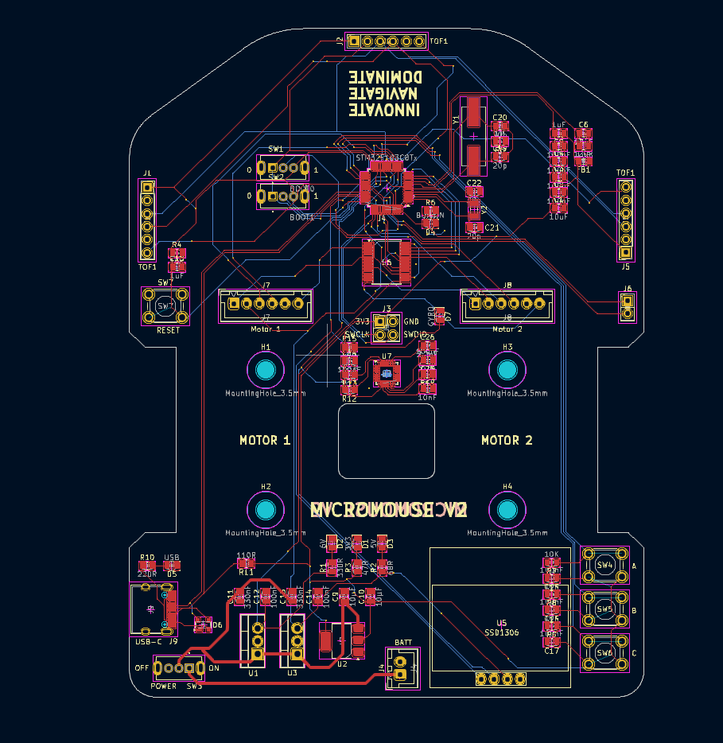
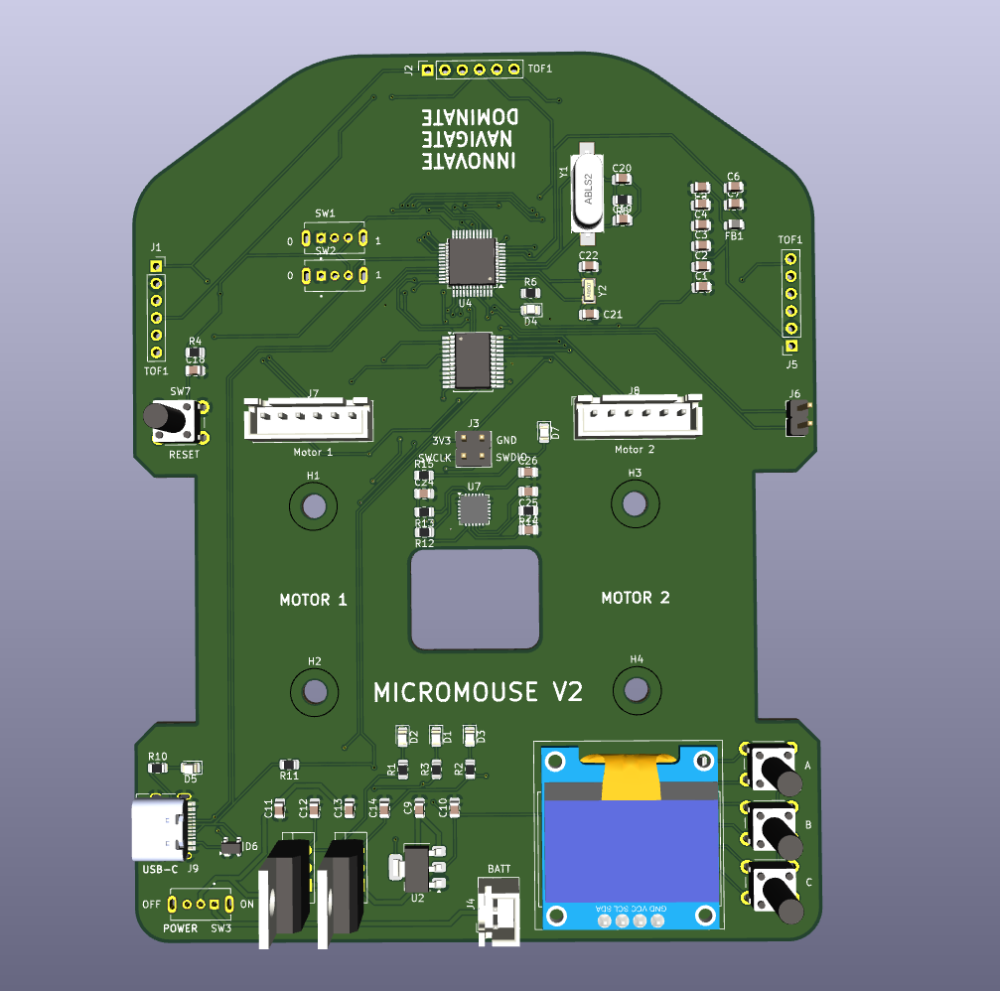
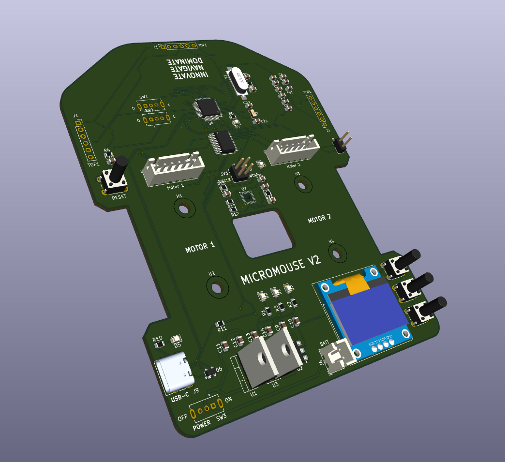

# Micromouse V2





This repository contains the design files, firmware, and documentation for a maze-solving car built using the STM32F103C8T6 microcontroller. The car is equipped with sensors, motors, and communication interfaces to autonomously navigate and solve mazes.

---

## Table of Contents
1. [Overview](#overview)
2. [Hardware Components](#hardware-components)
3. [PCB Design](#pcb-design)
4. [Firmware](#firmware)
5. [Communication Interfaces](#communication-interfaces)
6. [Setup and Usage](#setup-and-usage)
7. [Repository Structure](#repository-structure)
8. [License](#license)

---

## Overview

The maze-solving car is an autonomous robot designed to navigate through a maze using sensor data and decision-making algorithms. The car is built around the STM32F103C8T6 microcontroller and features the following key functionalities:
- **Maze Navigation**: Uses the MPU6050 (IMU) and VL53L0X (Time-of-Flight sensor) for orientation and distance measurement.
- **Motor Control**: TB6612FNG motor driver controls N20 motors for precise movement.
- **Debugging**: SSD1306 OLED display and UART communication for real-time debugging.
- **User Interface**: Three push buttons for menu selection and interaction.
- **Communication**: USB Type-C and UART interfaces for firmware updates and debugging.

---

## Hardware Components

### Microcontroller
- **STM32F103C8T6**: ARM Cortex-M3 based microcontroller for control and decision-making.

### Sensors
- **MPU6050**: 6-axis IMU for orientation and motion tracking.
- **VL53L0X**: Time-of-Flight (ToF) sensor for distance measurement.

### Motor Driver
- **TB6612FNG**: Dual motor driver for controlling N20 motors.

### Power Management
- **AMS1117**: 3.3V voltage regulator.
- **L7806CV**: 6V voltage regulator.
- **L7805CV**: 5V voltage regulator.

### Communication
- **USB Type-C**: For USB communication with the STM32.
- **UART Terminals**: For debugging and communication.
- **SWD (Serial Wire Debug)**: For STLink compatibility and firmware flashing.

### Other Components
- **N20 Motors**: Geared DC motors for movement.
- **SSD1306 OLED Display**: For debugging and status display.
- **Push Buttons**: Three buttons for menu selection and control.
- **SPDT Switch**: For boot mode selection.
- **Crystal Oscillators**:
  - **HSE**: 8 MHz (ABLS2-8.000MHZ-D4Y-T).
  - **LSE**: 32.768 kHz (ABS07-32.768KHZ-T).

> [!NOTE]
> The PCB design is optimized for 0805 SMD components, ensuring a compact and efficient layout.

---

## PCB Design

The PCB design files are available in the `hardware/` directory. The design includes:
- Schematic and layout files (e.g., KiCad, Altium, or Eagle).
- Gerber files for manufacturing.
- Bill of Materials (BOM) for component sourcing.

### Key Features of the PCB:
- Compact design optimized for maze-solving applications.
- Integrated power management with multiple voltage regulators.
- Debugging interfaces (UART, SWD, OLED display).
- USB Type-C for easy connectivity.

> [!TIP]
> Use the provided Gerber files for manufacturing the PCB. Ensure the manufacturer supports 2-layer boards with 1.6mm thickness.

---

## Firmware

The firmware for the maze-solving car is written in C using the STM32 HAL library. The code is located in the `firmware/` directory and includes the following features:
- **Maze Navigation Algorithm**: Implements wall-following or other maze-solving logic.
- **Sensor Integration**: Reads data from MPU6050 and VL53L0X sensors.
- **Motor Control**: Controls N20 motors using the TB6612FNG driver.
- **Debugging**: Displays real-time data on the SSD1306 OLED display.
- **User Interface**: Handles input from the push buttons.

### Dependencies
- STM32CubeMX for peripheral configuration.
- STM32 HAL library for hardware abstraction.

> [!IMPORTANT]
> Ensure the correct version of the STM32 HAL library is used to avoid compatibility issues.

> [!WARNING]
> Do not modify the STM32CubeMX configuration files manually. Always regenerate them using STM32CubeMX after making changes.

---

## Communication Interfaces

The car supports multiple communication interfaces for debugging and control:
1. **USB Type-C**: Used for firmware updates and communication with a PC.
2. **UART**: Serial communication for debugging and data logging.
3. **SWD**: For flashing firmware and debugging using STLink.

> [!TIP]
> Use a USB-to-UART converter for easy debugging via UART.

> [!CAUTION]
> Ensure the baud rate for UART communication matches between the car and the debugging tool.

---

## Setup and Usage

### Prerequisites
- STM32CubeIDE or any compatible IDE for firmware development.
- STLink or similar debugger for flashing the firmware.
- USB Type-C cable for communication and power.

### Steps to Use
1. **Flash the Firmware**:
   - Connect the STLink to the SWD terminals.
   - Open the project in STM32CubeIDE and flash the firmware.

2. **Power the Car**:
   - Connect a 7-12V power supply to the voltage regulators.

3. **Debugging**:
   - Use the UART terminals or OLED display for real-time debugging.

4. **Maze Navigation**:
   - Place the car in a maze and use the push buttons to start the navigation algorithm.

> [!WARNING]
> Double-check the polarity of the power supply connection to prevent damage to the PCB.

---

## Repository Structure
```
maze-solving-car-pcb/
├── firmware/                  # STM32 firmware source code
│   ├── Inc/                   # Header files
│   ├── Src/                   # Source files
│   └── STM32CubeMX/           # CubeMX configuration files
├── hardware/                  # PCB design files
│   ├── schematics/            # Schematic diagrams
│   ├── layout/                # PCB layout files
│   └── gerber/                # Gerber files for manufacturing
├── images/                    # Images and diagrams
├── docs/                      # Documentation and datasheets
└── README.md                  # This file
```

---

## License
This project is licensed under the MIT License. See the [LICENSE](LICENSE) file for details.

---

## Acknowledgments
- STMicroelectronics for the STM32 HAL library.
- Contributors to open-source hardware and software tools.

For questions or contributions, please open an issue or submit a pull request.

